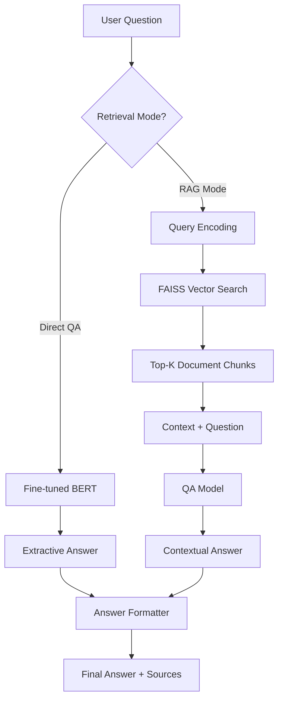

# Question Answering System

[](https://python.org)
[](https://huggingface.co/docs/transformers)
[](https://faiss.ai)
[](https://streamlit.io)
[](LICENSE)

Система вопросно-ответного анализа, объединяющая **Extractive QA** (fine-tuned BERT) с **Retrieval-Augmented Generation (RAG)** через векторный поиск FAISS. Модульный pipeline с веб-интерфейсом.

## Архитектура



## Возможности

- **Extractive QA** — Fine-tuned BERT для прямого вопрос-ответа
- **RAG Pipeline** — Retrieval-Augmented Generation с FAISS vector index
- **Индексация документов** — Поиск по PDF, DOCX и текстовым файлам
- **Интерактивный UI** — Streamlit и Gradio интерфейсы
- **Привязка к источникам** — Ответы со ссылками на исходные документы
- **Модульная архитектура** — Indexing, search, training и inference независимы

## Структура проекта

```
Question-answering/
├── src/
│   ├── app.py              # Streamlit/Gradio веб-интерфейс
│   ├── train_qa.py         # Fine-tuning QA модели
│   ├── rag_index.py        # Построитель FAISS индекса
│   ├── rag_search.py       # Векторный поиск
│   ├── rag_generate.py     # RAG генератор ответов
│   └── data_utils.py       # Загрузка и preprocessing данных
├── notebooks/              # Ноутбуки
├── requirements.txt
└── README.md
```

## Установка

```bash
git clone https://github.com/HolSoul/Question-answering.git
cd Question-answering

python -m venv .venv
.venv\Scripts\activate  # Windows
source .venv/bin/activate  # macOS/Linux

pip install -r requirements.txt
```

## Использование

### Запуск веб-интерфейса

```bash
streamlit run src/app.py
# или
gradio src/app.py
```

### Обучение QA модели

```bash
python src/train_qa.py
```

### Построение FAISS индекса

```bash
python src/rag_index.py --data_path /путь/к/документам
```

### Поиск через RAG

```bash
python src/rag_search.py --query "Ваш вопрос"
```

## Детали pipeline

### Обработка данных
- Парсинг документов (PDF, DOCX, TXT)
- Разбиение на чанки с перекрытием
- Генерация эмбеддингов через Sentence-BERT

### Extractive QA
- Fine-tuned BERT (distilbert/bert-base) на SQuAD-совместимых датасетах
- Token classification для стартовой/конечной позиции ответа
- Confidence scoring

### RAG Pipeline
1. Кодирование запроса в вектор
2. Поиск top-K похожих чанков в FAISS
3. Подача чанков + вопроса в QA модель
4. Возврат ответа с указанием источников

## Tech Stack

- **NLP Framework**: 🤗 Transformers, Sentence-Transformers
- **Vector Search**: FAISS (cpu)
- **Machine Learning**: PyTorch, scikit-learn
- **Data**: pandas, numpy, nltk
- **UI**: Streamlit, Gradio
- **Document Processing**: pdfplumber, python-docx

## Лицензия

MIT License
